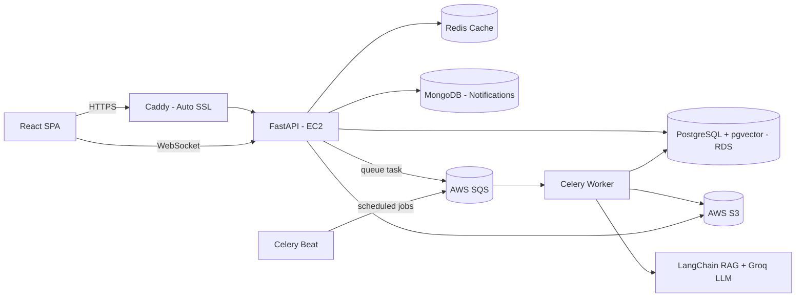

# SiteSync — Construction Project & Daily Site Log

🔗 **[Live Demo](https://getsitesync.vercel.app)** · 🎬 **[Demo Video](https://drive.google.com/file/d/1l8umfMvtsFmqvmx9zrP3nbgHdjgkLYcd/view?usp=drive_link)** · 💻 **[Frontend Repo](https://github.com/edrian-a-marinas/sitesync-client)**

## What It Does

Construction companies managing several job sites at once often lose track of daily progress, materials used, and money spent because everything is scattered across paper logs and spreadsheets. SiteSync brings all of that into one place — every shift, every material, every peso spent — so managers can log daily site activity and owners can instantly see how every project is doing, backed by thousands of historical records.

---

## Key Features (Backend)

- **Role-based access** — Owner, Project Manager, and Site Worker each see a different scope of data and actions.
- **Daily site logging** — workers present, materials consumed, equipment used, and incidents, submitted per shift.
- **File uploads** — progress photos, receipts, and inspection documents attached to daily logs.
- **Automated weekly reports** — PDF reports generated in the background and stored for download.
- **AI assistant** — ask natural language questions about cost, materials, workforce, or incidents across projects, powered by a LangChain + pgvector semantic search pipeline over historical site data. Answered queries are selectively embedded and reused as context for future questions within the same project.
- **Machine learning** — predictive models estimate budget overruns, delay risk, and material costs.
- **Live dashboards** — budget, workforce, and incident KPIs that update automatically as new activity is logged.
- **Real-time notifications** — in-app alerts (incidents, budget overruns, weekly reports) pushed live via WebSocket, backed by MongoDB. with instant Slack notification via webhook.

---

## Architecture Overview



---

## Tech Stack

| Layer       | Technology                                                                                                                            |
| ----------- | ------------------------------------------------------------------------------------------------------------------------------------- |
| Backend     | Python, FastAPI, SQLAlchemy, Alembic, Pytest, asyncio, SlowAPI, Webhooks, WebSocket                                                   |
| Frontend    | React, TypeScript, TanStack (Router, Table), Zod, Zustand, Axios, Radix UI, TailwindCSS                                               |
| AI / ML     | RAG pipeline — LangChain, pgvector, GroqAPI, scikit-learn, RandomForest - training, forecasting, and prediction (2 year seeded datas) |
| Database    | PostgreSQL (RDBMS), MongoDB(NoSQL), Redis(NoSQL cache)                                                                                |
| Security    | JWT, Role-based dependencies endpoints, Rate limiting, CORS, secrets credentials management, ORM-protected SQL, HTTPS                 |
| Performance | Redis (cache + broker), Celery/Beat, end-to-end pagination, Tanstack Query cache, database indexes                                    |
| Deployment  | AWS (EC2, RDS, S3), Docker, Caddy (reverse proxy + auto SSL), Vercel, GitHub Actions                                                  |

---

## API & Structure

- **Architecture**: Monolithic FastAPI backend, layered `routers → services → schemas → models`
- **Endpoints**: 77 REST endpoints across 16 relational tables — [Swagger Docs](https://drive.google.com/drive/folders/1T14fpvZQssFRVswHp2uzp9LEicIBZEJn?usp=sharing)
- **Validation**: End-to-end type-safe validation — Zod (frontend) → Pydantic (backend) → SQLAlchemy ORM (database)
- **Security middleware**: CORS, trusted host, GZip compression, custom security headers (HSTS, X-Frame-Options)
- **Rate limiting**: Per-endpoint limits via SlowAPI (e.g. 10/min on writes, 30/min on reads)
- **Caching**: Redis-backed response caching with pattern-based invalidation on writes
- **Async tasks**: AWS SQS Celery + Redis broker for background jobs — weekly report generation, scheduled triggers, cleanup
- **Real-time layer**: WebSocket connections for live in-app notifications, Slack webhook for incidents
- **Logging**: Centralized structured logging — tracks validation errors, HTTP exceptions, and startup connection health (DB, Redis, Celery)
- **Migrations**: Alembic-managed, version-controlled schema history
- **Code quality**: Enforced via Ruff (backend) and ESLint + Prettier (frontend)
- **Testing**: 492 Pytest tests, 91% coverage — routers, services, and business logic

---

## Deployment & DevOps

- **CI**: GitHub Actions runs on every push/PR to `main` and `dev` — spins up Postgres (pgvector), Redis, and MongoDB as services, lints with Ruff, then runs the full Pytest suite
- **CD**: On merge to `main`, GitHub Actions SSHs into the EC2 instance and redeploys via `docker compose up -d --build`
- **Containers**: Dockerized API, Celery worker, Celery beat, Redis, and MongoDB via Docker Compose, each with health checks and shared volumes for ML models
- **Infrastructure**: AWS EC2 (API host), RDS (PostgreSQL), S3 (file storage), fronted by Caddy for automatic HTTPS
- **Startup checks**: on boot, the app verifies DB, Redis, Celery broker, and MongoDB connectivity and logs environment mode (DEV/PROD).
- **Health checks**: `/health/db`, `/health/redis`, `/health/celery`, `/health/mongo`, `/health/webhook`, `/health/groq`, `/health/s3` endpoints, each reporting live connection status and latency

---

## Local Setup

### Prerequisites

- Docker & Docker Compose
- Bun (or Node.js) for the frontend

### Backend

1. Clone the repo and navigate into it

```bash
git clone https://github.com/edrian-a-marinas/sitesync-api.git
cd sitesync-api
```

2. Copy the environment template and fill in your values

```bash
cp .env.example .env
```

#### Option 1 — Docker (recommended)

Start all services (API, PostgreSQL, Redis, Celery worker, Celery beat)

```bash
docker compose up --build
```

Migrations run automatically on container start. API available at `http://localhost:8000/docs`

#### Option 2 — Local Python environment

Useful for active development with live reload.

```bash
python -m venv venv && source venv/bin/activate   # venv\Scripts\activate on Windows
pip install -r requirements.txt
alembic upgrade head
uvicorn app.main:app --reload
```

Run Celery worker and beat in separate terminals (same venv):

```bash
celery -A app.core.celery.celery_app worker --loglevel=info
celery -A app.core.celery.celery_app beat --loglevel=info
```

### Frontend

1. Clone the repo and navigate into it

```bash
git clone https://github.com/edrian-a-marinas/sitesync-client.git
cd sitesync-client
```

2. Install dependencies

```bash
bun install
```

3. Copy the environment template and fill in your values

```bash
cp .env.example .env.local
```

4. Start the dev server

```bash
bun run dev
```

5. App available at `http://localhost:5173`

---

## Congrats, App Running! 🎉

Make sure if logging in as PM / Owner, use the link:
`http://localhost:5173/login/admin`

**Owner:**

```
seed.owner@sitesync.com
test1234
```

**PM:**

```
seed.pm2@sitesync.com
test1234
```

**Worker:**

```
seed.worker3@sitesync.com
test1234
```

Or you can just use the **Demo Sign In** (read-only).

> **Reference:** Logging in as PM/Owner in `/login/` will fail, and vice versa with Worker.

_Built by Edrian Mariñas — 2026_
