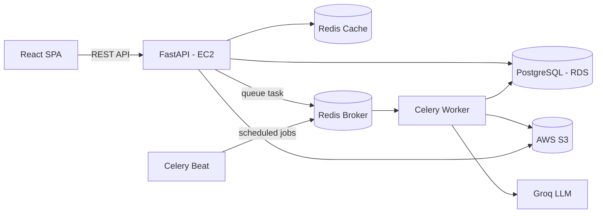

# SiteSync — Construction Project & Daily Site Log SaaS

🔗 **[Live Demo](https://getsitesync.vercel.app)** · 🎬 **[Demo Video](https://drive.google.com/file/d/1l8umfMvtsFmqvmx9zrP3nbgHdjgkLYcd/view?usp=drive_link)** · 💻 **[Frontend Repo](https://github.com/edrian-a-marinas/sitesync-client)**

## What It Does
Construction companies managing several job sites at once often lose track of daily progress, materials used, and money spent because everything is scattered across paper logs and spreadsheets. SiteSync brings all of that into one place — every shift, every material, every peso spent — so managers can log daily site activity and owners can instantly see how every project is doing, backed by thousands of historical records.

---

## Key Features
- **Role-based access** — Owner, Project Manager, and Site Worker each see a different scope of data and actions.
- **Daily site logging** — workers present, materials consumed, equipment used, and incidents, submitted per shift.
- **File uploads** — progress photos, receipts, and inspection documents attached to daily logs.
- **Automated weekly reports** — PDF reports generated in the background and stored for download.
- **AI assistant** — ask natural language questions about cost, materials, workforce, or incidents across projects.
- **Predictive analytics** — machine learning models forecast budget overruns, delay risk, and material costs.
- **Live dashboards** — budget, workforce, and incident KPIs that update automatically as new activity is logged.

---

## Architecture Overview



---

## Tech Stack
| Layer | Technology |
|-------|------------|
| Backend | Python, FastAPI, PostgreSQL, SQLAlchemy, Alembic, Pytest, asyncio, SlowAPI  |
| Frontend | React, TypeScript, TanStack (Router, Table), Zod, Zustand, Axios, Radix UI, TailwindCSS |
| AI / ML | RAG, GroqAPI, scikit-learn, RandomForest — training, forecasting, and prediction (2 year seeded datas) |
| Security | JWT, Role-based dependencies endpoints, Rate limiting, CORS, secrets credentials management, ORM-protected SQL, HTTPS |
| Performance | Redis (cache + broker), Celery/Beat, end-to-end pagination, Tanstack Query cache, database indexes |
| Deployment | AWS (EC2, RDS, S3), Docker, Vercel, GitHub Actions |

---

## API & Structure
- **Architecture**: Monolithic FastAPI backend, layered `routers → services → schemas → models`
- **Endpoints**: 69 REST endpoints across 13 relational tables — [Swagger Docs](https://drive.google.com/drive/folders/1T14fpvZQssFRVswHp2uzp9LEicIBZEJn?usp=sharing)
- **Validation**: End-to-end type-safe validation — Zod (frontend) → Pydantic (backend) → SQLAlchemy ORM (database)
- **Security middleware**: CORS, trusted host, GZip compression, custom security headers (HSTS, X-Frame-Options)
- **Rate limiting**: Per-endpoint limits via SlowAPI (e.g. 10/min on writes, 30/min on reads)
- **Caching**: Redis-backed response caching with pattern-based invalidation on writes
- **Async tasks**: Celery + Redis broker for background jobs — weekly report generation, scheduled triggers, cleanup
- **Logging**: Centralized structured logging — tracks validation errors, HTTP exceptions, and startup connection health (DB, Redis, Celery)
- **Migrations**: Alembic-managed, version-controlled schema history
- **Code quality**: Enforced via Ruff (backend) and ESLint + Prettier (frontend)
- **Testing**: 452 Pytest tests, 92% coverage — routers, services, and business logic

---

## Local Setup

### Prerequisites
- Docker & Docker Compose
- Bun (or Node.js) for the frontend

### Backend

1. Clone the repo and navigate into it
```bash
   git clone https://github.com/edrian-a-marinas/sitesync-api.git
   cd sitesync-api
```
2. Copy the environment template and fill in your values
```bash
   cp .env.example .env
```

#### Option 1 — Docker (recommended)

Start all services (API, PostgreSQL, Redis, Celery worker, Celery beat)
```bash
   docker compose up --build
```
Migrations run automatically on container start. API available at `http://localhost:8000/docs`

#### Option 2 — Local Python environment
Useful for active development with live reload.
```bash
   python -m venv venv && source venv/bin/activate   # venv\Scripts\activate on Windows
   pip install -r requirements.txt
   alembic upgrade head
   uvicorn app.main:app --reload
```
Run Celery worker and beat in separate terminals (same venv):
```bash
   celery -A app.core.celery.celery_app worker --loglevel=info
   celery -A app.core.celery.celery_app beat --loglevel=info
```

### Frontend

1. Clone the repo and navigate into it
```bash
   git clone https://github.com/edrian-a-marinas/sitesync-client.git
   cd sitesync-client
```
2. Install dependencies
```bash
   bun install
```
3. Start the dev server
```bash
   bun run dev
```
4. App available at `http://localhost:5173`


---

*Built by Edrian Mariñas — 2026*